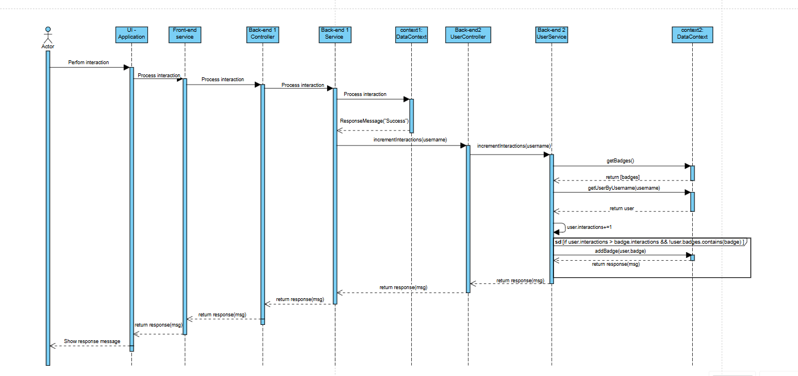

# UC04 - Receive Badges based on activity

### System Sequence Diagram

### User Story

_As a user, I want to receive badges based on my activity_

### Acceptance Criteria

1. The user receives a badge based on the number of comments, posts, and other interactions they make.
2. The badges are displayed on the user's profile page.
3. The badges must be a valid badge from the database.

### Full Sequence Diagram

### [Back to Use Cases](../README.md)