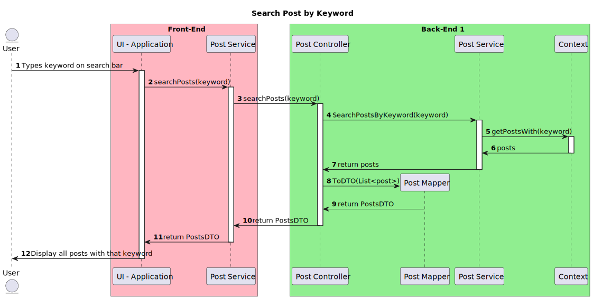

# UC05 - Search posts by keyword

### System Sequence Diagram

### User Story

_As a user, I want to search for posts by keyword, so that I can find relevant information quickly_

### Acceptance Criteria

1. The system must search for posts that contain the specified keyword in its title.
2. The system must return the relevant posts with pagination and links to the user.

### Full Sequence Diagram

### [Back to Use Cases](../README.md)